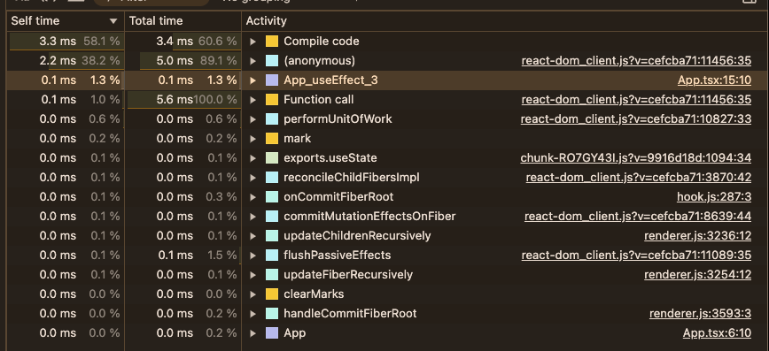

<br />
<br />

<h1 align="center">@custardcream/babel-plugin-react-effect-namer</h1>
<p align="center">
  A Babel plugin that transforms anonymous callback functions in React's effect hooks
  <br />
  into <bold>named functions</bold> to improve debugging and readability.
</p>

<p align="center">
  <a href="https://www.npmjs.com/package/@custardcream/babel-plugin-react-effect-namer" target="_blank"></a>
</p>

<br />
<br />

- **Better Debuggability:** Meaningful function names help generate clearer stack traces.
- **Enhanced Readability:** Cleaner, self-documenting code.
- **Non-Intrusive:** Only transforms callbacks that are anonymous.

---

## Overview

This plugin automatically transforms anonymous callbacks passed to React's `useEffect` and `useLayoutEffect` into named functions. Providing explicit names results in clearer stack traces during debugging and makes your code easier to understand.

---

## Features

- **Transforms Arrow Functions:** Converts arrow functions into named function expressions.
- **Transforms Anonymous Function Expressions:** Converts standard anonymous functions to named ones.
- **Unique Naming:** Automatically assigns unique names (e.g., `MyComponent_useEffect_1`, `MyComponent_useEffect_2`) when multiple effects are present.
- **Safe Transformations:** Leaves already named functions untouched.



You can check effect hook names on stack traces.

---

## Installation

```bash
npm install --save-dev @custardcream/babel-plugin-react-effect-namer
```

---

## Usage

Configure Babel to use the plugin. Here’s an example using a `babel.config.js`:

```js
module.exports = {
  plugins: ['@custardcream/babel-plugin-react-effect-namer'],
};
```

Once configured, any React component using `useEffect` or `useLayoutEffect` with an anonymous callback will be transformed.

---

## Examples

### 1. Transforming an Arrow Function Callback

**Before transformation:**

```jsx
import React, { useEffect } from 'react';

function MyComponent() {
  useEffect(() => {
    console.log('Effect run');
  }, []);

  return <div>Hello</div>;
}
```

**After transformation (the actual output might vary in formatting):**

```jsx
import React, { useEffect } from 'react';

function MyComponent() {
  const MyComponent_useEffect_1 = () => {
    console.log('Effect run');
  };

  useEffect(MyComponent_useEffect_1, []);

  return <div>Hello</div>;
}
```

### 2. Transforming an Anonymous Function Expression

**Before transformation:**

```jsx
import React, { useEffect } from 'react';

function MyComponent() {
  useEffect(function () {
    console.log('Effect run');
  }, []);

  return <div>Hello</div>;
}
```

**After transformation:**

```jsx
import React, { useEffect } from 'react';

function MyComponent() {
  function MyComponent_useEffect_1() {
    console.log('Effect run');
  }

  useEffect(MyComponent_useEffect_1, []);

  return <div>Hello</div>;
}
```

### 3. Handling Multiple Effect Hook Calls

When a component has more than one effect hook call, the plugin assigns unique names to each callback.

**Before transformation:**

```jsx
import React, { useEffect } from 'react';

function MyComponent() {
  useEffect(() => {
    console.log('First effect');
  }, []);

  useEffect(() => {
    console.log('Second effect');
  }, []);

  return <div>Hello</div>;
}
```

**After transformation:**

```jsx
useEffect(MyComponent_useEffect_1, []);
useEffect(MyComponent_useEffect_2, []);
```
